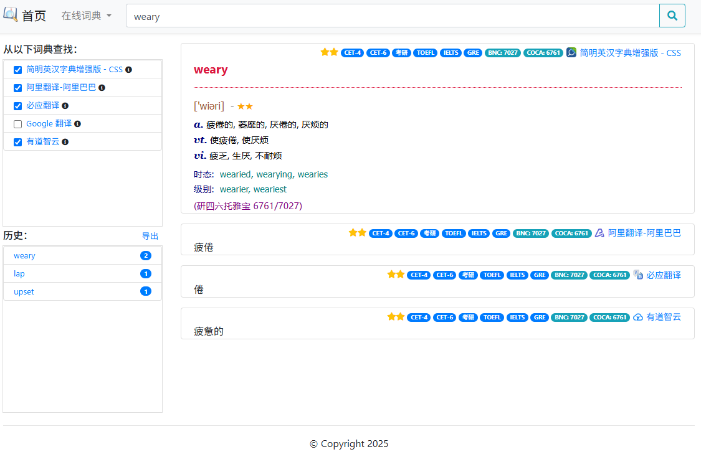

======
MDict
======

Screenshot
==========

Usage
======
Install
--------
::

    git clone https://github.com/liuyug/flask-mdict.git

    cd flask-mdict
    pip3 install -r requirements.txt

    mkdir content
    # copy MDICT dictionary into content directory
    cp <mdict> content/

    # ecdict
    wget https://github.com/skywind3000/ECDICT/raw/master/ecdict.csv'
    sh ecdict.sh ecdict.csv
    mv ecdict.db content/

Run
----
::

    flask run

Browser
--------
::

    firefox http://127.0.0.1:5000

.. note::

    +   MDict original query code come from mdx-server_
    +   Python3

.. _mdx-server: https://github.com/ninja33/mdx-server
