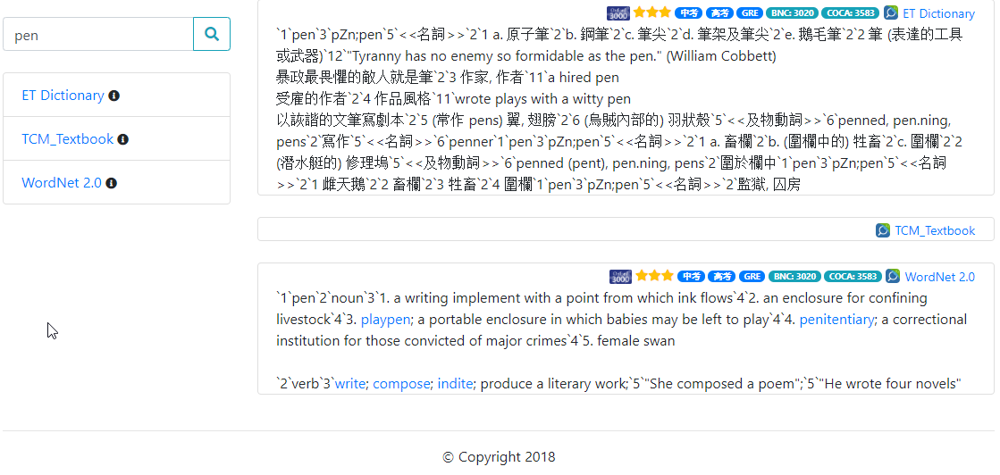

===========
Flask-MDict
===========

.. NOTE::

    Follow MIT and 996.ICU license.

Screenshot
==========

.. image:: mdict_screenshot.png

Usage
======
Install
--------
::

    git clone https://github.com/liuyug/flask-mdict.git

    cd flask-mdict
    pip3 install -r requirements.txt

    mkdir content
    # copy MDICT dictionary into content directory
    cp <mdict> content/

    # install word frequency database from ecdict csv
    ecdict.sh
    # or copy current ecdict_wfd.db to your content directory
    # cp ecdict_wfd.db content/

Run
----
Cli::

    python app.py

    python app.py --mdict-dir your_mdict_path

    python app.py --host 127.0.0.1:5248

Flask::

    flask run

Browser
--------
::

    firefox http://127.0.0.1:5678

.. note::

    +   MDict original query code come from mdx-server_
    +   Python3

.. _mdx-server: https://github.com/ninja33/mdx-server

Donate 捐赠
===========
请捐赠者在 issue 里留下捐赠信息，如交易流水号等，否则无法在支付系统里查找。再次感谢。

.. image:: alipay_pay.jpg
    :width: 45%

.. image:: wx_pay.png
    :width: 45%

